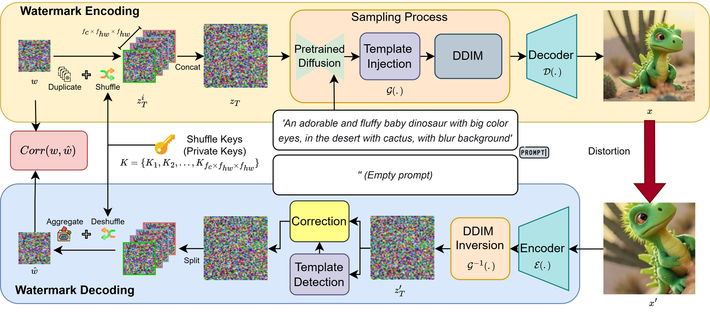

# MaXsive: High-Capacity and Robust Training-Free Generative Image Watermarking in Diffusion Models

**Authors:** Po-Yuan Mao, Cheng-Chang Tsai, Chun-Shien Lu  
**Paper:** [arXiv:2507.21195](https://arxiv.org/abs/2507.21195)  
**Project Page:** https://mao718.github.io/blog/2025/MaXive/ 

This repository contains the official implementation of MaXsive, a training-free generative image watermarking method for diffusion models.



---

## 🚀 Releases

- **2025/08/12:** Initial codebase release with WAVEs verification.

---

## 📁 Data Structure

```
root/
└── MaXsive/
    ├── data/
    │   ├── 0000.pt
    │   ├── 0001.pt
    │   └── ...
    ├── positive_image/
    │   ├── 0000.jpg
    │   ├── 0001.jpg
    │   └── ...
    └── WAVE_positive_image/
        ├── 0000/
        │   ├── 0000_blurring_0_2.jpg
        │   ├── 0000_blurring_0_4.jpg
        │   └── ...
        └── 0001/
            ├── 0001_blurring_0_2.jpg
            ├── 0001_blurring_0_4.jpg
            └── ...
```

---

## ⚠️ Notice

- Please use `diffusers` version **0.11.1** for compatibility.
- While this repository includes implementations of other watermarking methods, we strongly recommend using their original codebases for best results.

## 🖼️ Watermarked Image Generation

Generate data and positive images:

```bash
python image_generate.py --output_path 'root/MaXsive/' --watermark_model 'MaXsive' --model_id 'watermarkSD21'
```

---

## 🌊 Generate WAVEs Distortion Images

Create WAVEs distortion images from positive images:

```bash
python wave_attacks.py 'root/MaXsive/'
```

---

## 📊 Evaluation

Evaluate on clean images:

```bash
python eva_clean.py --root 'root/MaXsive/' --tpr_file 'threshold/MaXsive-cos.pt' --filename 'clean_result.txt'
```

Evaluate on WAVEs distortions:

```bash
python eva_attack.py --root 'root/MaXsive/' --attacked_path 'WAVE_positive_image/' --tpr_file 'threshold/MaXsive-cos.pt' --distortion_list 'attack_config/WAVEs.json' --filename 'MaXsive_WAVEs_result.txt'
```

---

## 📚 Citation

If you use MaXsive, please cite:

```bibtex
@article{mao2025maxsive,
  title={MaXsive: High-Capacity and Robust Training-Free Generative Image Watermarking in Diffusion Models},
  author={Mao, Po-Yuan and Tsai, Cheng-Chang and Lu, Chun-Shien},
  journal={ACM International Conference on Multimedia},
  year={2025}
}
```

---

<!-- 
python F_image_generate.py --output_path 'test/RingID/' --watermark_model 'RingID'
python F_image_generate.py --output_path 'test/tree-ring/' --watermark_model 'tree-ring'
python F_image_generate.py --output_path 'test/Gaussian-shading/' --watermark_model 'Gaussian-shading'
-->
